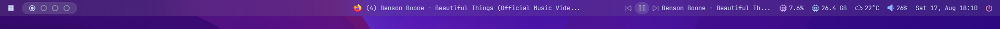

# acrylic

## Image


## Config
<details>
<summary>Config content (click to expand)</summary>

```yaml
watch_stylesheet: true
watch_config: true


# This komorebi setting will be used for tray context menu.
# If you don't use komorebi, you can remove this section.
komorebi:
  start_command: "komorebic start --whkd"
  stop_command: "komorebic stop --whkd"
  reload_command: "komorebic reload-configuration"
  
# This is the main configuration file for Yet Another Status Bar (YASB)
bars:
  status-bar:
    enabled: true
    #screens: ['DELL P2419H (1)'] 
    #screens: ['DELL P2419H (2)'] 
    screens: ['*'] 
    class_name: "yasb-bar"
    alignment:
      position: "top"
      center: false
    blur_effect:
      enabled: true
      acrylic: false
      dark: false
    window_flags:
      always_on_top: false
      windows_app_bar: true
    dimensions:
      width: "100%"
      height: 32
    padding:
      top: 0
      left: 0
      bottom: 0
      right: 0
    widgets:
      left:
        [
          "win_button",
          "komorebi_workspaces",
          
        ] 
      center: [
         "active_window"
        ]
      right:
        [
          "media",
          "cpu",
          "memory",
          "weather",
          "volume",
          "clock",
          "power_menu"
        ]
widgets:
  media:
    type: "yasb.media.MediaWidget"
    options:
      label: "{title} - {artist}"
      label_alt: "{title}"
      max_field_size:
        label: 20
        label_alt: 30
      show_thumbnail: false
      controls_only: false
      controls_left: true
      hide_empty: true
      thumbnail_alpha: 80
      thumbnail_padding: 8
      thumbnail_corner_radius: 16 # Set to 0 for square corners
      icons:
        prev_track: "\ue892"
        next_track: "\ue893"
        play: "\ue768"
        pause: "\ue769"

  active_window:
    type: "yasb.active_window.ActiveWindowWidget"
    options:
      label: "{win[title]}"
      label_alt: "[class_name='{win[class_name]}' exe='{win[process][name]}' hwnd={win[hwnd]}]"
      label_no_window: ""
      label_icon: true
      label_icon_size: 16
      max_length: 56
      max_length_ellipsis: "..."
      monitor_exclusive: true

  battery:
    type: "yasb.battery.BatteryWidget"
    options:
      label: "<span>{icon}</span>{percent}%"
      label_alt: "{icon} {percent}% | time: {time_remaining}"
      charging_options:
        icon_format: "{charging_icon}"

  clock:
    type: "yasb.clock.ClockWidget"
    options:
      label: "{%a %d, %b %H:%M}"
      label_alt: "{%A %d %B %Y, %H:%M}"
      #locale: 'en_EN' # Langugae for date, you can set your own, example fr_FR
      timezones: [] #Looking up time zone info from registry
      #timezones: ["America/Montreal"]

  cpu:
    type: "yasb.cpu.CpuWidget"
    options:
      label: "<span>\uf4bc</span> {info[percent][total]}%"
      label_alt: "<span>\uf437</span> {info[histograms][cpu_percent]}"
      update_interval: 2000
      histogram_icons:
        - '\u2581' # 0%
        - '\u2581' # 10%
        - '\u2582' # 20%
        - '\u2583' # 30%
        - '\u2584' # 40%
        - '\u2585' # 50%
        - '\u2586' # 60%
        - '\u2587' # 70%
        - '\u2588' # 80%+
      histogram_num_columns: 8
      callbacks:
        on_right: "exec cmd /c Taskmgr"

  memory:
    type: "yasb.memory.MemoryWidget"
    options:
      label: "<span>\uf4bc</span> {virtual_mem_free}"
      label_alt: "<span>\uf4bc</span> {virtual_mem_percent}%"
      update_interval: 10000
      callbacks:
        on_right: "exec cmd /c Taskmgr"

  komorebi_workspaces:
    type: "komorebi.workspaces.WorkspaceWidget"
    options:
        label_offline: "Komorebi Offline"
        label_workspace_btn: "\udb81\udc3d"
        label_workspace_active_btn: "\udb81\udc3e"
        label_default_name: "{index}"
        label_zero_index: false
        hide_empty_workspaces: false
        hide_if_offline: false

  komorebi_active_layout:
    type: "komorebi.active_layout.ActiveLayoutWidget"
    options:
      hide_if_offline: true
      label: "{icon}"
      layouts: ['bsp', 'columns', 'rows', 'grid', 'vertical_stack', 'horizontal_stack', 'ultrawide_vertical_stack','right_main_vertical_stack']
      layout_icons:
        bsp: "BSP"
        columns: "COLS"
        rows: "ROWS"
        grid: "GRID"
        vertical_stack: "V-STACK"
        horizontal_stack: "H-STACK"
        ultrawide_vertical_stack: "W-STACK"
        right_main_vertical_stack: "RMV-STACK"
        monocle: "MONOCLE"
        maximised: "MAX"
        floating: "FLOATING"
        paused: "PAUSED"
      callbacks:
        on_left: 'next_layout'
        on_middle: 'toggle_monocle'
        on_right: 'prev_layout'

  wifi:
    type: "yasb.wifi.WifiWidget"
    options:
      label: "<span>{wifi_icon}</span>"
      label_alt: "{wifi_name} {wifi_strength}%"
      update_interval: 5000
      callbacks:
        on_left: "exec cmd.exe /c start ms-settings:network"
        on_middle: "do_nothing"
        on_right: "toggle_label"

  traffic:
    type: "yasb.traffic.TrafficWidget"
    options:
      label: "<span>\udb86\uddb3</span>{download_speed} | <span>\udb86\uddb2</span>{upload_speed}"
      label_alt: "Download {download_speed} \ue621 Upload {upload_speed}"
      update_interval: 1000 # Update interval should be a multiple of 1000
      callbacks:
        on_left: "toggle_label"
        on_right: "exec cmd /c Taskmgr"

  ip_info:
    type: "yasb.custom.CustomWidget"
    options:
      label: "<span>\udb81\udd9f</span> {data[ip]}"
      label_alt: "<span>\uf450</span> {data[city]} {data[region]}, {data[country]}"
      class_name: "ip-info-widget"
      exec_options:
        run_cmd: "curl.exe https://ipinfo.io"
        run_interval: 120000  # every 5 minutes
        return_format: "json"
      callbacks:
        on_left: "toggle_label"
        on_middle: "exec cmd /c ncpa.cpl" # open network settings
        on_right: "exec cmd /c start https://ipinfo.io/{data[ip]} " # open ipinfo in browser

  weather:
    type: "yasb.weather.WeatherWidget"
    options:
      label: "<span>{icon}</span> {temp_c}"
      label_alt: "{location}: Min {min_temp_c}, Max {max_temp_c}, Humidity {humidity}"
      api_key: '3bf4cf9a7c3f40d6b31174128242807' # Get your free API key from https://www.weatherapi.com/
      update_interval: 600 # Update interval in seconds, Min 600 seconds
      hide_decimal: true
      location: 'Los Angeles, CA, USA' # You can use "USA Los Angeles 90006" {COUNTRY CITY ZIP_CODE}, or just city.
      callbacks:
        on_left: "toggle_label"
      icons: 
        sunnyDay: "\ue30d"
        clearNight: "\ue32b"
        cloudyDay: "\udb81\udd99"
        cloudyNight: "\ue311"
        rainyDay: "\udb81\ude7e"
        rainyNight: "\udb81\ude7e"
        snowyIcyDay: "\udb81\udd98"
        snowyIcyNight: "\udb81\udd98"
        blizzard: "\uebaa"
        default: "\uebaa"
        # https://www.weatherapi.com/docs/
        # Usage {temp_c}, {min_temp_c}, {max_temp_c}, {temp_f}, {min_temp_f}, {max_temp_f}, {location}, {humidity}, {icon}, {conditions}

  lang:
    type: "yasb.custom.CustomWidget"
    options:
      label: "<span>\uf1ab</span>{data}"
      label_alt: "{data}"
      class_name: "lang-widget"
      exec_options:
        run_cmd: "powershell Add-Type -AssemblyName System.Windows.Forms;([System.Windows.Forms.InputLanguage]::CurrentInputLanguage).Culture.Name"
        # run every 10 sec
        run_interval: 10000
        return_format: "string"

  volume:
    type: "yasb.volume.VolumeWidget"
    options:
      label: "<span>{icon}</span> {level}"
      label_alt: "{volume}"
      volume_icons:
        - "\ueee8"  # Icon for muted
        - "\uf026"  # Icon for 0-10% volume
        - "\uf027"  # Icon for 11-30% volume
        - "\uf027"  # Icon for 31-60% volume
        - "\uf028"  # Icon for 61-100% volume
      callbacks:
        on_right: "exec cmd.exe /c start ms-settings:sound"

  power_menu:
    type: "yasb.power_menu.PowerMenuWidget"
    options:
      label: "\uf011"
      uptime: True
      blur: False
      blur_background: True
      animation_duration: 300 # Milisecond 
      button_row: 3 # Number of buttons in row, min 1 max 5
      buttons:
        lock: ["\uea75","Lock"]
        signout: ["\udb80\udf43","Sign out"]
        #sleep: ["\u23fe","Sleep"]
        shutdown: ["\uf011","Shut Down"]
        restart: ["\uead2","Restart"]
        hibernate: ["\uf28e","Hibernate"]
        cancel: ["\udb81\udf3a","Cancel"]
        #force_shutdown: ["\uf011","Force Shut Down"]
        #force_restart: ["\uead2","Force Restart"]
 

  apps:
    type: "yasb.applications.ApplicationsWidget"
    options:
      label: "{data}"
      app_list:
        #- {icon: "\uf489", launch: "wt"}
        #- {icon: "\uf413", launch: "explorer c:\\Users\\amn"}
        #- {icon: "\udb82\ude1e", launch: "C:\\Users\\amn\\AppData\\Local\\Programs\\Microsoft VS Code\\Code.exe"}
        #- {icon: "\udb80\ude39", launch: "C:\\Program Files\\Mozilla Firefox\\firefox.exe"}
        #- {icon: "\uf1ff", launch: "C:\\Users\\amn\\AppData\\Local\\Discord\\Update.exe --processStart Discord.exe"}
        #- {icon: "\ue217", launch: "C:\\Users\\amn\\AppData\\Roaming\\Telegram Desktop\\Telegram.exe"}
        - {icon: "\uf0a2", launch: "notification_center"}
        - {icon: "\ueb51", launch: "quick_settings"}
        #- {icon: "\uf46a", launch: "cmd.exe /c start ms-settings:windowsupdate"}
        - {icon: "\uf422", launch: "search"}
        #- {icon: "\udb84\udf55", launch: "widget"}
        # Currently available to use quick_settings, notification_center, search, widget, launcher (launcher will trigger ALT+A)
 

  github:
    type: "yasb.github.GithubWidget"
    options:
      label: "<span>\ueba1</span>"
      label_alt: "Notifications {data}" # {data} return number of unread notification
      token: ghp_xxxxxxxxxxx # GitHub Personal access tokens (classic) https://github.com/settings/tokens
      max_notification: 20 # Max number of notification displaying in menu max: 50
      only_unread: false # Show only unread or all notifications; 
      max_field_size: 54 # Max characters in title before truncation.
      menu_width: 400 
      menu_height: 400 
      menu_offset: 240 
      update_interval: 300 # Check for new notification in seconds

  wallapers:
    type: "yasb.wallpapers.WallpapersWidget"
    options:
      label: "<span>\udb83\ude09</span>"
      image_path: "C:\\Users\\xxx\\Images" # Path to folder with images
      change_automatically: false # Automatically change wallpaper
      update_interval: 60 # If change_automatically is true, update interval in seconds

  nvidia_temp:
    type: "yasb.custom.CustomWidget"
    options:
      label: "{data}<span>\udb81\udd04</span>"
      label_alt: "{data}"
      class_name: "system-widget"
      exec_options:
        run_cmd: "powershell nvidia-smi --query-gpu=temperature.gpu --format=csv,noheader"
        run_interval: 10000 # run every 10 sec
        return_format: "string"

  win_button:
    type: "yasb.custom.CustomWidget"
    options:
      label: "\ue62a"
      label_alt: "\ue62a"
      class_name: "system-widget"
      callbacks:
        on_left: "exec start_menu"
```

</details>

## Style
<details>
<summary>Styles content (click to expand)</summary>

```css
/*
.widget .label {} -> Global label for all
.active-window-widget {} -> Styles specific to the active window widget
.clock-widget {} -> Styles specific to the clock widget
.cpu-widget {} -> Styles specific to the CPU widget
.memory-widget {} -> Styles specific to the memory widget
.weather-widget {} -> Styles specific to the weather widget
.komorebi-workspaces {} -> Styles specific to komorebi workspaces
.komorebi-active-layout {} -> Styles specific to komorebi active layout
.volume-widget {} -> Styles specific to the volume widget 
.apps-widget {} -> Styles specific to the apps widget
.power-menu-widget {} -> Styles for the power menu button widget
.power-menu-popup {} -> Styles for the power menu popup widget
.power-menu-popup > .button {} -> Styles for power buttons inside the popup 
.power-menu-popup > .button > .icon,
.power-menu-popup > .button > .label {} -> Styles for power buttons icons and labels inside the popup 
.media-widget {} -> Styles specific to the media widget
.github-widget {} -> Styles specific to the github widget
*/
* {
	font-size: 12px;
	color: #cdd6f4;
	font-weight: 500;
	font-family: "JetBrainsMono NFP";
	margin: 0;
	padding: 0;
}
.yasb-bar {
	padding: 0 8px;
	margin: 0;
    background-color: rgba(146, 145, 155, 0.16);
}
.widget {
	padding: 0 8px;
	margin: 0;
}
 
 
 
.container-left,
.container-center,
.container-right {
	margin: 0;
	padding: 0;
}
.active-window-widget .icon {
    margin-right: 8px;
}

.komorebi-active-layout .label {
	font-weight: 600;
	padding: 2px 0 0 0;
}
.komorebi-workspaces .widget-container {
    background-color: rgba(188, 195, 207, 0.178);
    margin: 4px 0;
    border-radius: 12px;
}
.komorebi-workspaces .ws-btn {
	font-size: 14px;
    background-color: transparent;
	margin: 0 4px 0 4px;
	color: #95a0ad;
    padding: 0;
}
.komorebi-workspaces .ws-btn.populated {
	color: #a0c3ee;
}
.komorebi-workspaces .ws-btn:hover,
.komorebi-workspaces .ws-btn.populated:hover,
.komorebi-workspaces .ws-btn.active {
	color: #c2daf7;
}
 

/*POWER MENU WIDGET*/
/* Uptime text */
.uptime {
	font-size: 14px;
	margin-bottom: 10px;
	color: #ffffff;
	font-weight: 600;
	font-family: "Segoe UI", Tahoma, Geneva, Verdana, sans-serif;
}
.power-menu-widget .label {
	color: #f38ba8;
	font-size: 13px;
}
.power-menu-popup {
	background-color: rgba(24, 24, 37, 0.9);
	border-radius: 12px;
	border: 4px solid rgb(41, 42, 58);
}
.power-menu-popup .button {
	padding: 0;
	width: 240px;
	height: 120px;
	border-radius: 8px;
	background-color: rgb(41, 42, 58);
	font-family: "SegoeUI";
	color: white;
	border: 1px solid rgba(255, 255, 255, 0.1);
	margin: 8px;
}
.power-menu-popup .button.hover {
	background-color: rgb(55, 56, 75);
	border: 1px solid rgb(55, 56, 75);
}
.power-menu-popup .button .label {
	margin-bottom: 8px;
	font-size: 16px;
	font-weight: 600;
	color: rgba(255, 255, 255, 0.95);
	font-family: "Segoe UI", Tahoma, Geneva, Verdana, sans-serif;
}
.power-menu-popup .button .icon {
	font-size: 48px;
	padding-top: 8px;
	color: rgba(255, 255, 255, 0.25);
}
.power-menu-popup .button.cancel .icon {
	color: rgba(243, 139, 168, 0.55);
}
.power-menu-popup .button.cancel .label {
	color: rgba(243, 139, 168, 0.95);
}
.power-menu-popup .button.shutdown .icon {
	color: rgba(137, 180, 250, 0.55);
}
.power-menu-popup .button.shutdown .label {
	color: rgba(137, 180, 250, 0.95);
}

/* ICONS */
.icon {
	font-size: 16px;
}
.volume-widget .icon {
	color: #89b4fa;
}
 
.cpu-widget .icon,
.memory-widget .icon,
.volume-widget .icon,
.weather-widget .icon,
.wifi-widget .icon {
	margin: 0 4px 1px 0;
}
.cpu-widget .icon,
.memory-widget .icon {
	font-size: 14px;
	color: #cba6f7;
}
.memory-widget .icon {
	color: #a6c9f7;
}
.wifi-widget .icon {
    font-size: 14px;
	color: #43d8d8;
}
.weather-widget .icon.sunnyDay {
	color: rgb(221, 210, 107);
}
.weather-widget .icon.clearNight {
	color: rgb(107, 189, 221);
	font-size: 22px;
	margin: 1px 2px 0px 0;
}

/* MEDIA WIDGET */
.media-widget {
	padding: 0;
	padding-left: 2px;
	margin: 0;
	border-radius: 16px;
	margin-right: 8px;
}
.media-widget .label {
	background-color: rgba(0, 0, 0, 0.0);
}
.media-widget .btn {
	color: #acb2c9;
	padding: 0 3px;
	margin: 4px 0;
	font-family: Segoe Fluent Icons;
}
.media-widget .btn:hover {
	color: #89b4fa;
}
.media-widget .btn.play {
	background-color: rgba(188, 195, 207, 0.178);
	border-radius: 12px;
	font-size: 14px;
}
.media-widget .btn.disabled:hover,
.media-widget .btn.disabled {
	color: #4e525c;
	font-size: 12px;
	background-color: rgba(0, 0, 0, 0);
}

```
</details>

