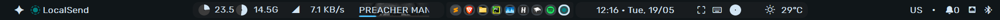

# dots-windows



[](https://github.com/amnweb/yasb)
[](https://www.microsoft.com/windows)
[](https://github.com/end-4/dots-hyprland)

> No tiling, just bar.

<p align="center">
  <strong>🌍 English | <a href="#-русский">Русский</a></strong>
</p>

---

## 📸 Preview


###### the taskbar at the bottom is from windhawk. Mod: Windows 11 Taskbar Styler. Style: WindowGlass (split)

---

## Features

- **Minimalist design** inspired by dots-hyprland
- **Device-aware widgets** — battery indicator appears only on portable devices
- **Custom widgets**: screenshoter (PrintScreen), on-screen keyboard, dot separator, control center
- **Weather widget** with one-time location setup
- **12/24h clock toggle** via right-click
- **Auto-hide** for unavailable widgets (WiFi, Bluetooth, brightness)

---

## 📦 Installation

### 1. Install Required Fonts

For proper rendering, install these fonts:
- **[Rubik](https://fonts.google.com/specimen/Rubik)**
- **[JetBrains Mono](https://www.jetbrains.com/lp/mono/)**

### 2. Configure Weather


If you see overlay text instead of weather:
1. Click the placeholder (rightmost element near center)
2. Enter your location (data is stored locally)
3. Enjoy real-time weather

**To change location later:**
```powershell
# Delete the weather cache file
Remove-Item "$env:LOCALAPPDATA\YASB\weather.json"

# Reload YASB via system tray: Right-click icon → "Reload YASB"
```

---

## Bar Layout (Left → Right)

### Left Section
| Widget | Description |
|--------|-------------|
| Power Menu | Shutdown, restart, sleep, logout |
| Active App | Name of currently focused application |

### Center Section
| Widget | Description |
|--------|-------------|
| CPU Load | Real-time processor usage |
| RAM | Memory usage indicator |
| Network | Upload/download speed |
| Media | Current track/app with audio (hidden when silent) |
| Taskbar | All open windows across virtual/desktop workspaces |


> 💡 **Tip:** Prefer workspace switching over taskbar?  
> Edit `config.yaml` at `~/.config/yasb/` and uncomment
> 
> Change this: #"windows_workspaces",  To: "windows_workspaces",
> 
> Change this: "taskbar",  To: #"taskbar",


### Right Section
| Widget                            | Description |
|-----------------------------------|-------------|
| Clock                             | Time & date (right-click to toggle 12/24h format) |
| Actions                           | Screenshoter On-screen keyboard Brightness* |
| Weather                           | Current conditions & temperature |
| Layout                            | Current keyboard input language |
| •                                 | Decorative dot separator |
| Notifications                     | System notification indicator |
| Control Center (WiFi / Bluetooth) | Connection status |

*\*Brightness control appears only on supported devices*

---

## ⚙️ Configuration & Troubleshooting

### Centering Issues

If the bar appears misaligned:

1. Open `~/.config/yasb/style.css`
2. Adjust `margin`
3. Save & reload YASB


### 📁 Config Paths Reference

| File | Purpose | Path |
|------|---------|------|
| `config.yaml` | Widget configuration & behavior | `~/.config/yasb/` |
| `style.css` | Visual styling & positioning | `~/.config/yasb/` |
| `weather.json` | Cached weather location | `%LOCALAPPDATA%\YASB\` |

> `~` = `C:\Users\your_username` on Windows

---

## Who Is This For?

1. &#9989; Windows 11 users seeking a clean, modern status bar  
2. &#9989; Fans of minimalism & dots-hyprland aesthetics  
3. &#9989; Users who want enhancements without replacing their workflow  

❌ Not for users seeking a full tiling window manager experience

---

## Language Support

This README is available in:
- 🇬🇧 **English** (current)
- 🇷🇺 **[Русский](#-русский)** *(see bottom of file)*

---

## 🙏 Thanks

- [YASB](https://github.com/amnweb/yasb) — The powerful status bar tool
- [end-4](https://github.com/end-4) — Original inspiration from [dots-hyprland](https://github.com/end-4/dots-hyprland)
- Font authors: Google Fonts (Rubik), JetBrains (Mono)

---


<details>
<summary><h2 id="-русский">🇷🇺 Русский (Russian)</h2></summary>

> Современная тема для YASB, вдохновлённая dots-hyprland от end-4. Минималистичный бар для Windows 11 без тайлинга.

### Возможности
- Минималистичный дизайн в стиле dots-hyprland
- Адаптация под устройства — батарея только на ноутбуках
- Кастомные виджеты: screenshoter, экранная клавиатура, разделитель-точка, панель управления
- Погода с выбором локации
- Переключение 12/24ч по ПКМ
- Авто-скрытие ненужных виджетов

### 📦 Установка
1. Установите шрифты **Rubik** и **JetBrains Mono**
2. Настройте погоду: нажмите на placeholder, введите локацию
3. Для смены локации: удалите `%LOCALAPPDATA%\YASB\weather.json` и перезагрузите YASB

### Структура бара (слева направо)
- **Слева**: Power Menu, активное приложение
- **Центр**: CPU, RAM, сеть, медиа, taskbar (или workspaces)
- **Справа**: часы, действия, погода, раскладка, уведомления, WiFi/Bluetooth

### ⚙️ Настройка
- Центрирование: правьте `~/.config/yasb/style.css`
- Конфиги: `config.yaml` (поведение), `style.css` (стили)

### 🙏 Благодарности
YASB • end-4 • dots-hyprland

</details>
